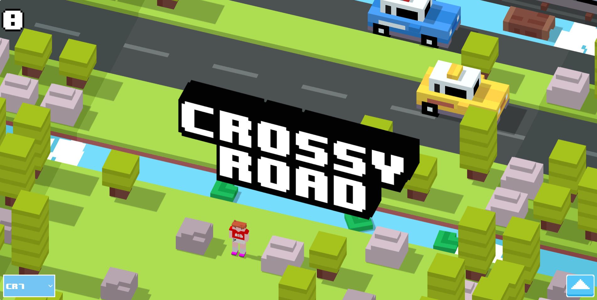

# CS105 - Computer Graphics

## 

For our final project in CS105 - Computer Graphics, I propose to create a browser-based remake of the popular game "Crossy Road".

## Models

This project adapts the Voxel Graphics style, using [MagicalVoxel](https://ephtracy.github.io/), an open-source project, to create voxel-based models for characters and environment elements.

If you'd like to see someone else in the game or have any relevant ideas, please open an issue!

## Stack

- Expo (ios, android, web)
- React Native for web (web)
- THREE.js for rendering
- GSAP for animating

## Install

### Clone this repository:

```bash
git clone https://github.com/Dev-Aligator/Crossy-ComGraphics.git
```

### Next, install the dependencies:

```bash
 npm i --force
```

### To start the web version of the game, run:

```bash
 npx expo start --web
```
